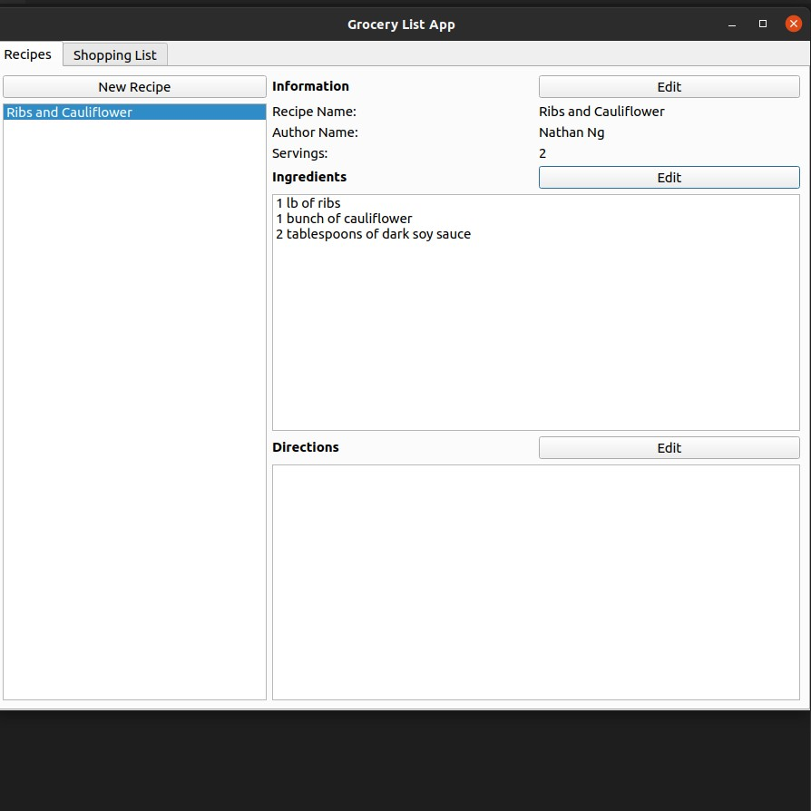

# Grocery List Generator

## Problem
I waste time grocery shopping because I do not know exactly how many ingredients I need for the week.

## Solution
This program stores recipes and allows users to create shopping lists by adding recipes to them. By doing this, the user knows exactly how much of each ingredient to buy. 

## Implementation
This desktop application is written in Python and uses the PySide6 library.

## Snapshot as of Jun. 9, 2022

## TODO
- Build out the shopping list tab
- Add an Import/Export Tab
- Implement email library which allows users to share shopping lists or recipes with email.
